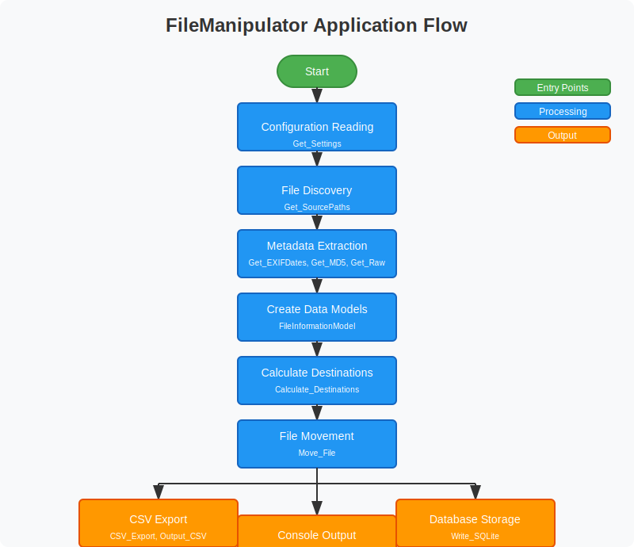

# FileManipulator

## Table of Contents

- [FileManipulator](#filemanipulator)
  - [Table of Contents](#table-of-contents)
  - [Overview](#overview)
  - [Purpose](#purpose)
  - [Getting Started](#getting-started)
    - [Requirements](#requirements)
    - [Installation](#installation)
    - [Configuration](#configuration)
  - [Usage](#usage)
  - [How It Works](#how-it-works)
  - [Features](#features)
  - [Development Notes](#development-notes)
  - [Project Structure](#project-structure)
    - [Core Models](#core-models)
    - [Interfaces](#interfaces)
    - [Utilities and Services](#utilities-and-services)
    - [Data Processing](#data-processing)
    - [Output and Reporting](#output-and-reporting)
    - [Application Entry Points](#application-entry-points)
  - [Planned Improvements](#planned-improvements)
    - [Code Structure Improvements](#code-structure-improvements)
    - [Features Improvements](#features-improvements)
    - [User Interface Improvements](#user-interface-improvements)
    - [Performance Improvements](#performance-improvements)
  - [License](#license)
  - [Contributions](#contributions)
  - [Credits](#credits)
  - [Appendices](#appendices)
  - [Appendix: Project Files and Their Purposes](#appendix-project-files-and-their-purposes)
    - [.NET Core Methods Documentation Links](#net-core-methods-documentation-links)
      - [Path Class Methods](#path-class-methods)
      - [DateTime Class Methods](#datetime-class-methods)
      - [Directory Class Methods](#directory-class-methods)
      - [File Class Methods](#file-class-methods)
      - [Serialization Methods](#serialization-methods)
      - [Configuration Methods](#configuration-methods)
      - [Hashing Methods](#hashing-methods)
      - [Notes](#notes)
  - [Application Control (Controller Classes)](#application-control-controller-classes)
    - [Configuration Files](#configuration-files)

## Overview

FileManipulator is a C# application that organizes and categorizes media files (photos, videos, and RAW images) based on their metadata. It's a C# implementation of a PowerShell script designed to make the process more efficient and user-friendly.

## Purpose

The application solves the common problem of organizing large collections of media files by:

- Analyzing file metadata (EXIF data, file system creation dates, modification dates)
- Creating structured folder hierarchies based on date information
- Generating reports of file information
- Storing file information in a SQLite database for future reference

## Getting Started

### Requirements

- .NET 6.0 or higher
- SQLite database
- Windows OS (primarily tested on Windows)

### Installation

1. Clone this repository or download the source code
2. Build the solution using Visual Studio or the .NET CLI
3. Ensure the SQLite database file is properly set up

### Configuration

Edit the `appsettings.json` file to configure:

- Source directory path
- Destination directory path
- Date source preference (EXIF, created, modified)
- CSV export path
- Database connection strings

Example configuration:

```json
{
  "ConnectionString": "Data Source=.\\FileManipulator.db;Version=3",
  "ProviderName": "System.Data.SqlClient",
  "CSVExportPath": "C:\\ExportPath\\",
  "DateSource": "EXIF",
  "DestinationBase": "C:\\DestinationPath",
  "SourcePath": "C:\\SourcePath\\"
}
```

## Usage

1. Configure the application by editing `appsettings.json`
2. Run the application from the command line or through Visual Studio
3. Follow the menu options:
   - Option 1: View file information in JSON format
   - Option 2: Export file information to CSV
   - Option 3: Import file information to the database
   - Option 4: View database contents
   - Exit: Close the application

## How It Works



The application follows these processing steps:

1. **Configuration Reading**:

   - Reads paths and preferences from appsettings.json
   - Validates source and destination directories

2. **File Discovery**:

   - Scans source directories for supported media file types
   - Filters based on file extensions (.jpg, .raw, .mp4, etc.)

3. **Metadata Extraction**:

   - Reads EXIF data from image files (date taken, camera info)
   - Extracts file system metadata (creation date, modification date)
   - Generates MD5 hash for each file for identification

4. **Destination Path Calculation**:

   - Determines target paths based on extracted dates
   - Creates folder structure (Year/Month-Year/Day-Month-Year)
   - Handles RAW files by placing them in separate "RAW" subfolders

5. **Output Generation**:

   - Option to export to CSV (for record keeping)
   - Option to output JSON to console (for inspection)
   - Option to store in SQLite database (for persistent storage)

6. **Future Plans (Optional)**:
   - File movement functionality based on calculated destinations

## Features

- Multiple date source options (EXIF, file creation, file modification)
- Support for various image formats including RAW formats
- MD5 hash generation for file integrity and duplicate detection
- CSV export functionality
- SQLite database integration
- Configurable source and destination paths via JSON configuration

## Development Notes

Each source code file in this project contains detailed notes at the top of the file as a multi-line comment. These notes provide:

1. A description of the file's purpose and functionality
2. Eight specific areas planned for future improvement
3. Detailed recommendations for each improvement area

These notes serve as documentation for the current codebase and as a roadmap for future development. They are designed to help new developers understand the code structure and planned enhancements without modifying the actual functionality.

## Project Structure

The application consists of several key components:

### Core Models

- [FileInformationModel.cs](/Classes/FileInformationModel.cs) - Primary data model that stores all information about a media file
- [PublicFileInformationModel.cs](/Classes/PublicFileInformationModel.cs) - Data transfer object for database operations and serialization

### Interfaces

- [ICalculate_Destinations.cs](/Interfaces/ICalculate_Destinations.cs) - Interface for destination path calculation
- [IGet_Dates.cs](/Interfaces/IGet_Dates.cs) - Interface for retrieving dates from various sources
- [IGet_MD5.cs](/Interfaces/IGet_MD5.cs) - Interface for file hash calculation
- [IGet_Raw.cs](/Interfaces/IGet_Raw.cs) - Interface for RAW file detection

### Utilities and Services

- [CheckExists.cs](/Classes/CheckExists.cs) - Utility for validating file and directory existence
- [Get_Settings.cs](/Classes/Get-Settings.cs) - Configuration manager for application settings
- [Get_SourcePaths.cs](/Classes/GatherSourcePaths.cs) - Service for finding media files in source directories
- [Get_MD5.cs](/MethodClasses/Get-MD5.cs) - Service for calculating file MD5 hashes
- [Get_Raw.cs](/MethodClasses/Get-Raw.cs) - Service for detecting RAW image formats
- [Get_EXIFDates.cs](/MethodClasses/Get-EXIFDates.cs) - Service for extracting EXIF date metadata
- [Get_FSCreationDate.cs](/MethodClasses/Get-FSCreationDate.cs) - Service for retrieving file system creation dates
- [Get_FSLastWriteDate.cs](/MethodClasses/Get-FSLastWriteDate.cs) - Service for retrieving file system modification dates

### Data Processing

- [Calculate_Destinations.cs](/MethodClasses/Calculate-Destinations.cs) - Determines destination paths based on dates
- [Gather_Files_Create_Models.cs](/MethodClasses/Gather-Files_Create-Models.cs) - Orchestrates file discovery and model creation
- [Move_File.cs](/MethodClasses/Move-File.cs) - Handles file movement operations to destination paths

### Output and Reporting

- [CSV_Export.cs](/MethodClasses/CSV-Export.cs) - Exports file information to CSV format
- [Output_CSV.cs](/MethodClasses/Output-CSV.cs) - Orchestrates the CSV export process
- [Output_Screen.cs](/MethodClasses/Output-Screen.cs) - Displays file information on the console
- [Output_DBContentsToScreen.cs](/MethodClasses/Output-DBContentsToScreen.cs) - Displays database contents on the console
- [Write_SQLite.cs](/MethodClasses/Write-SQLite.cs) - Handles database operations for storing file information

### Application Entry Points

- [Program.cs](/Program.cs) - Application entry point and initialization
- [MainMenu.cs](/Classes/MainMenu.cs) - Main menu and user interface implementation

## Planned Improvements

### Code Structure Improvements

- Implement better separation of concerns
- Move more functionality to interfaces for improved testability
- Standardize error handling patterns
- Implement dependency injection for better modularity
- Add comprehensive logging framework

### Features Improvements

- Add duplicate file detection based on MD5 hash
- Implement file preview functionality
- Add support for incremental processing of large directories
- Include batch processing capabilities for handling large collections
- Enhance metadata extraction capabilities
- Add support for additional media formats

### User Interface Improvements

- Create a simple GUI interface
- Add progress indicators for long-running operations
- Implement logging with different verbosity levels
- Add interactive file exploration capabilities
- Create visual reporting dashboards

### Performance Improvements

- Optimize file reading operations for large files
- Implement parallel processing for better performance on multi-core systems
- Add caching mechanism to avoid repeated metadata reads
- Implement streaming operations for reduced memory usage
- Add asynchronous processing for better responsiveness

## License

This software is available under a dual-licensing model:

**For Personal Use**: GNU General Public License v3.0

- Free to use, modify, and distribute
- Requires attribution and sharing source code of modifications
- See LICENSE.md for full GPL-3.0 terms

**For Commercial Use**: Commercial License

- Requires purchasing a license from [joshua@rpdigi.net](joshua@rpdigi.net)
- Contact for pricing and terms
- Allows use in commercial environments without GPL restrictions

Please respect the licensing terms and contact the author for any questions about usage.

## Contributions

Contributions are welcome. Please open an issue or submit a pull request on the project repository.

## Credits

Developed by Joshua Porrata

## Appendices

For detailed reference information, please see the following documents:

- [Project Files and Their Purposes](docs/PROJECT_FILES.md) - Comprehensive details about each component in the project
- [External Dependencies and Documentation](docs/EXTERNAL_DEPENDENCIES.md) - Links to documentation for all libraries and methods used

## Appendix: Project Files and Their Purposes

### .NET Core Methods Documentation Links

#### Path Class Methods

- `Path.GetFileName()`: [Microsoft Docs - Path.GetFileName Method](https://docs.microsoft.com/en-us/dotnet/api/system.io.path.getfilename)
- `Path.GetExtension()`: [Microsoft Docs - Path.GetExtension Method](https://docs.microsoft.com/en-us/dotnet/api/system.io.path.getextension)
- `Path.Combine()`: [Microsoft Docs - Path.Combine Method](https://docs.microsoft.com/en-us/dotnet/api/system.io.path.combine)

#### DateTime Class Methods

- `DateTime`: [Microsoft Docs - DateTime Struct](https://docs.microsoft.com/en-us/dotnet/api/system.datetime)
- `DateTime.Parse()`: [Microsoft Docs - DateTime.Parse Method](https://docs.microsoft.com/en-us/dotnet/api/system.datetime.parse)

#### Directory Class Methods

- `Directory.Exists()`: [Microsoft Docs - Directory.Exists Method](https://docs.microsoft.com/en-us/dotnet/api/system.io.directory.exists)
- `Directory.CreateDirectory()`: [Microsoft Docs - Directory.CreateDirectory Method](https://docs.microsoft.com/en-us/dotnet/api/system.io.directory.createdirectory)
- `Directory.GetFiles()`: [Microsoft Docs - Directory.GetFiles Method](https://docs.microsoft.com/en-us/dotnet/api/system.io.directory.getfiles)

#### File Class Methods

- `File.Exists()`: [Microsoft Docs - File.Exists Method](https://docs.microsoft.com/en-us/dotnet/api/system.io.file.exists)
- `File.Move()`: [Microsoft Docs - File.Move Method](https://docs.microsoft.com/en-us/dotnet/api/system.io.file.move)
- `File.GetCreationTime()`: [Microsoft Docs - File.GetCreationTime Method](https://docs.microsoft.com/en-us/dotnet/api/system.io.file.getcreationtime)
- `File.GetLastWriteTime()`: [Microsoft Docs - File.GetLastWriteTime Method](https://docs.microsoft.com/en-us/dotnet/api/system.io.file.getlastwritetime)

#### Serialization Methods

- `JsonSerializer`: [Microsoft Docs - System.Text.Json Namespace](https://docs.microsoft.com/en-us/dotnet/api/system.text.json)
- `JsonSerializerOptions`: [Microsoft Docs - JsonSerializerOptions Class](https://docs.microsoft.com/en-us/dotnet/api/system.text.json.jsonserializeroptions)

#### Configuration Methods

- `ConfigurationBuilder`: [Microsoft Docs - ConfigurationBuilder Class](https://docs.microsoft.com/en-us/dotnet/api/microsoft.extensions.configuration.configurationbuilder)
- `AddJsonFile()`: [Microsoft Docs - IConfigurationBuilder.AddJsonFile Method](https://docs.microsoft.com/en-us/dotnet/api/microsoft.extensions.configuration.jsonconfigurationextensions.addjsonfile)

#### Hashing Methods

- `MD5.Create()`: [Microsoft Docs - MD5.Create Method](https://docs.microsoft.com/en-us/dotnet/api/system.security.cryptography.md5.create)
- `BitConverter.ToString()`: [Microsoft Docs - BitConverter.ToString Method](https://docs.microsoft.com/en-us/dotnet/api/system.bitconverter.tostring)

#### Notes

- Always refer to the most recent Microsoft documentation for the most up-to-date information.
- These links are accurate as of the time of writing and may change with .NET framework updates.

## Application Control (Controller Classes)

- **MainMenu.cs**

  - **Type**: Controller class
  - **Purpose**: User interface and application flow
  - **Methods**:
    - Constructor creates menu loop and handles input
  - **Process Flow**: Display options → Get input → Execute corresponding function

- **Program.cs**
  - **Type**: Application entry point
  - **Purpose**: Initializes application
  - **Methods**:
    - `Main(string[] args)` → Application entry point
  - **Process Flow**: Creates MainMenu instance which starts the application

### Configuration Files

- **appsettings.json**

  - **Type**: Configuration file (JSON)
  - **Purpose**: Stores application settings
  - **Key Settings**: Paths, connection strings, preferences
  - **Used By**: Get_Settings class

- **FileManipulator.csproj**

  - **Type**: Project file (.NET)
  - **Purpose**: Defines project structure and dependencies
  - **Key Elements**: NuGet package references, build settings

- **FileManipulator.sln**
  - **Type**: Solution file (Visual Studio)
  - **Purpose**: Organizes project for development environment
